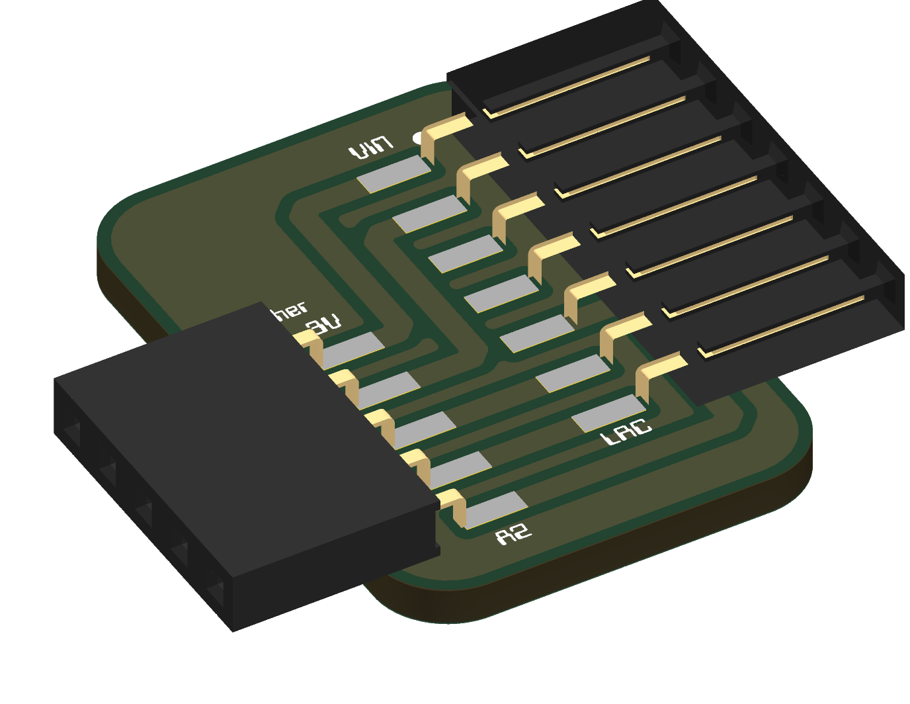
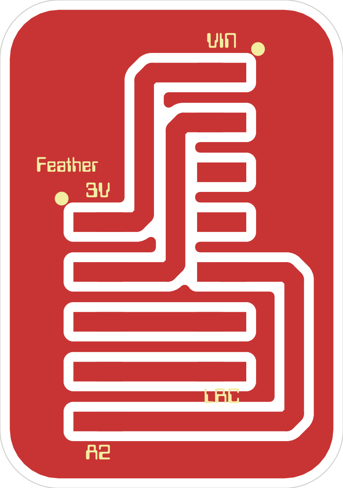
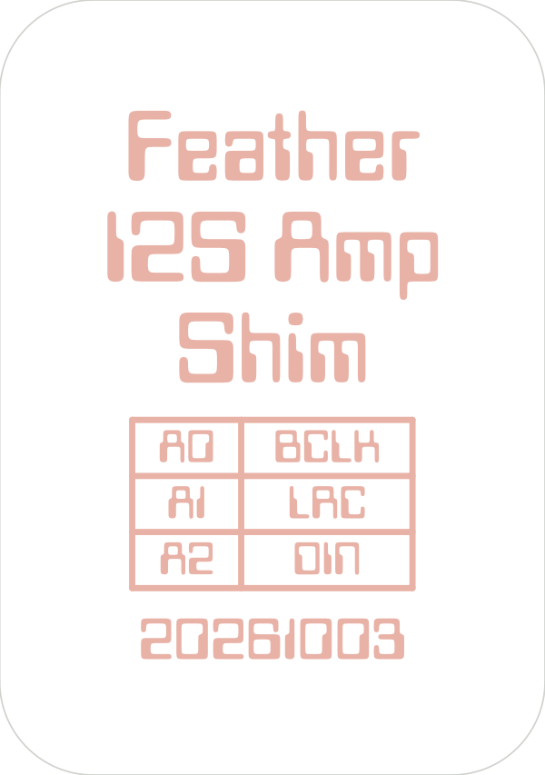

# i2s-amp-shim

A direct-connect shim PCB that mates the Adafruit I2S 3W Class D amp breakout (MAX98357A, **#3006**) to a Feather. No breadboard or jumper wires needed.

## About

A passive shim with no components: two right-angle SMD sockets and five traces. The Feather plugs into one edge. The amp plugs into the other edge, standing vertical with its parts facing away from the Feather. Both sockets overhang the board (75% on the Feather side, 61% on the amp side), which keeps the shim to 17.5 × 24.9 mm.

Single copper layer, made for a home build: the outline is milled and the copper is ablated with a fiber laser. Design files are in [`kicad/`](kicad/). The board comes entirely from `kicad/build_pcb.py`.

## Pinout

| Feather | Amp (#3006) | Notes |
|---------|-------------|-------|
| 3V      | Vin         | |
| GND     | GND         | |
| A0      | BCLK        | |
| A1      | LRC         | must be the pin after BCLK for RP2xxx PIO I2S |
| A2      | DIN         | |
| —       | SD          | open: amp outputs (L+R)/2 mono |
| —       | GAIN        | open: 9 dB |

### CircuitPython usage

```python
import audiobusio, board
i2s = audiobusio.I2SOut(bit_clock=board.A0, word_select=board.A1, data=board.A2)
```

## Board notes

- **No crossings.** A0→BCLK and A1→LRC are straight across. A2→DIN runs under the south end of the amp socket and comes into pin 5 from behind.
- **Traces:** 1.0 mm, the full width of the socket pads, with at least 0.6 mm between traces.
- **GND** is a routed trace. The rest of the board is unconnected copper fill with a 0.5 mm gap around every trace and pad, so the laser has less to remove. The fill stays 0.5 mm back from the outline.
- **Front silk:** a label sits past each end of each socket's pin row, where the soldered socket doesn't cover it: 3V and A2 on the Feather side, VIN and LRC on the amp side.
- **Back silk** (burned with the laser): the board name, an A0/A1/A2 → BCLK/LRC/DIN table, and the date.
- **Etch art:** `kicad/etch/etch-FCu-MIRRORED-1to1.pdf` (print at 100%) and `etch-FCu-reference.pdf`.

## Layout





## License

[MIT](LICENSE)

The 3D models in `kicad/3dmodels/` are stock KiCad library models under CC-BY-SA 4.0.
